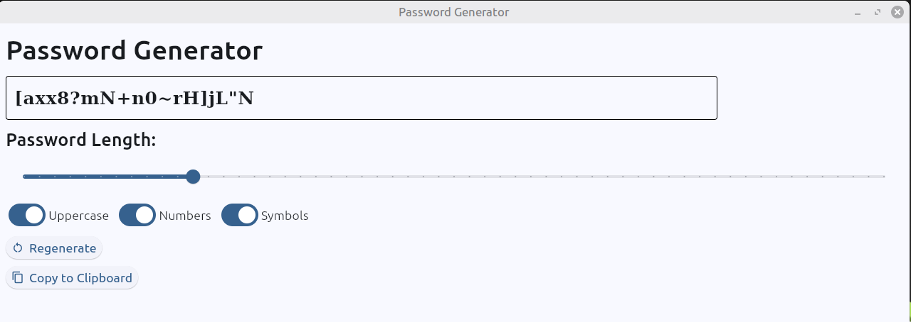

# Generador de Contraseñas
[](README.md) [](README.es.md)



## Un generador de contraseñas creado con Python

### Instalación

Descarga el proyecto:

```
git clone https://github.com/GmartosMC/password-generator
```

Recomiendo crear un entorno virtual para no tener problemas con las dependencias. En la raiz del proyecto en terminal:

```
python -m venv nombreEntorno
```

Para activarlo, en Windows en la raiz del proyecto usa:

```
nombreEntorno\Scripts\activate
```

En Linux y Mac:

```
source nombreEntorno/bin/activate
```

Este proyecto usa Flet para la GUI. Puedes simplemente instalar las dependencias con el siguiente comando dentro del proyecto:

```
python -m pip install -r requirements.txt
```

O si quieres instalarlo manualmente:

```
pip install flet
```

Para ejecutarlo, con la terminal en la raiz del proyecto, escribe:

```
flet run
```